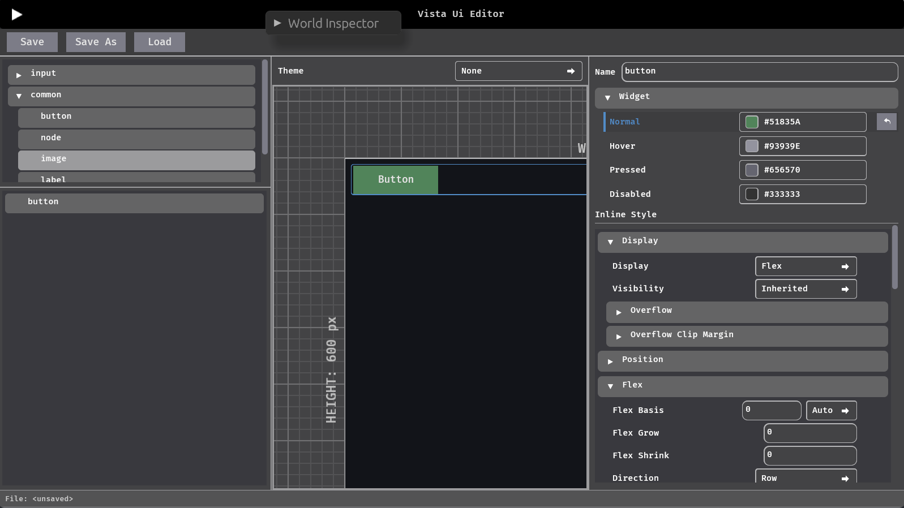
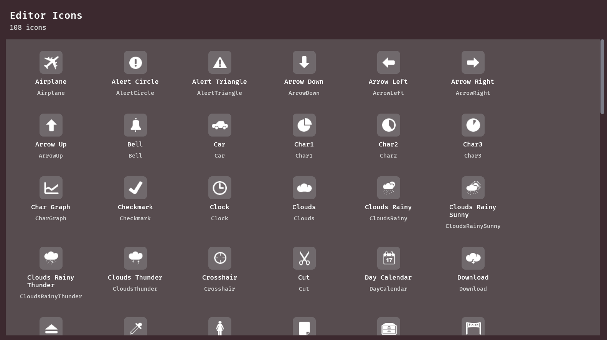

# bevy_vista

`bevy_vista` is a visual UI editor runtime/plugin for Bevy UI.
It focuses on editable UI composition, inspector-driven props, and `.vista.ron` serialization for reusable UI documents.

## Features

- Editor UI based on **pure bevy UI**
- Floating + fullscreen editor modes (`VistaEditorMode`)
- Grid, zoom, pan, and preview workflow in viewport
- Save / Load UI documents as `.vista.ron`
- `Widget` derive + auto-registration for custom widgets
- Inspector metadata derive (`ShowInInspector`) for editable properties
- 100+ editor icons

## Compatibility

| bevy_vista | Bevy |
| --- | --- |
| `0.17.x` | `0.17` |

## Usage

See [USAGE](./docs/USAGE.md) and **examples**

## Quick Start

```toml
[dependencies]
bevy = "0.17"
bevy_vista = "0.17"
```

```rust
use bevy::prelude::*;
use bevy_vista::prelude::*;

fn main() {
    App::new()
        .add_plugins(DefaultPlugins)
        .add_plugins(VistaUiPlugin)
        .add_systems(Startup, setup)
        .run();
}

fn setup(mut commands: Commands) {
    commands.spawn((Camera2d, IsDefaultUiCamera));
}
```

## Screenshots

### Full editor layout

example: [full_editor](examples/quick_full_editor.rs)



### Editor Icons

example: [editor_icons_gallery](examples/editor_icons_gallery.rs)


